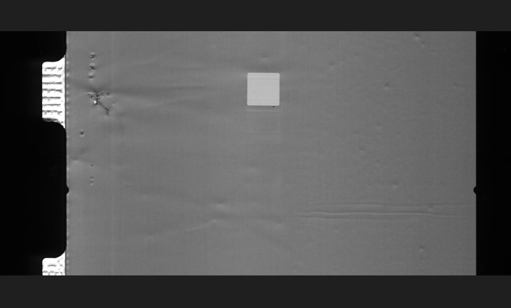
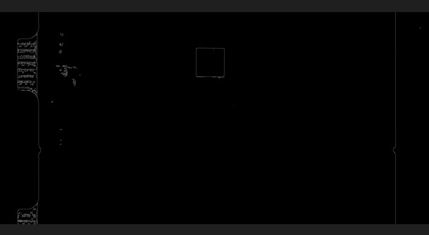
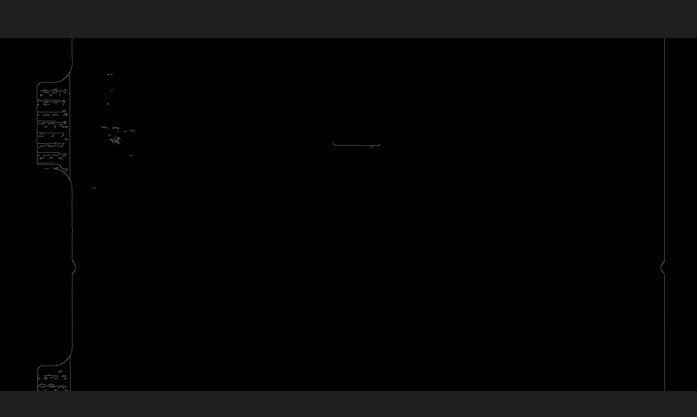
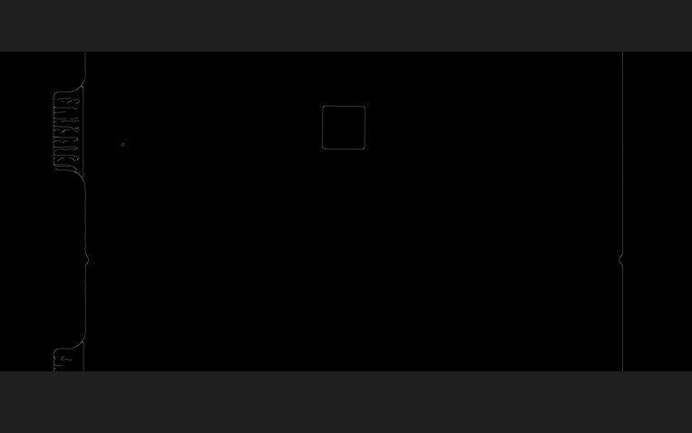

# 2023-4-25  
- [2023-4-25](#2023-4-25)
  - [原图](#原图)
  - [无滤波](#无滤波)
  - [均值滤波](#均值滤波)
  - [中值滤波](#中值滤波)
  - [高斯滤波](#高斯滤波)

测试中值滤波 均值滤波以及高斯滤波对canny算子边缘检测的影响    

## 原图

  

## 无滤波

  

## 均值滤波

    

## 中值滤波

## 高斯滤波

经过测试均值滤波与高斯滤波均会损失边缘信息, 所以最终选择中值滤波作为选项